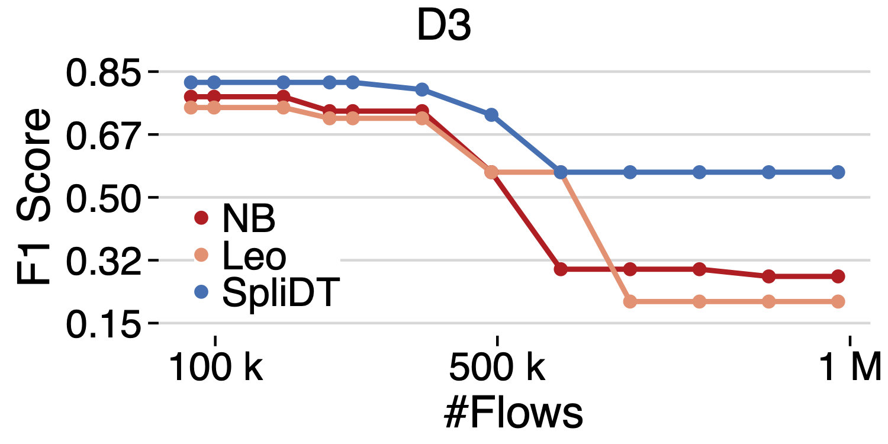

# SpliDT Artifact Evaluation for NSDI'26

This guide describes how to access the pre-configured VM to evaluate SpliDT on one dataset as described in the NSDI'26 publication: 
*SPLIDT: Partitioned Decision Trees for Scalable Stateful Inference at Line Rate*.

## a. Accessing the Pre-Configured VM
We have provided a VM with the entire codebase installed and dataset already downloaded to make the evaluation more accessible for evaluators.

> **Note:** The SSH credentials and keys to access the VM are provided to the evaluators on HotCRP.

## b. Running Experiments

> **Note:** In the home directory at `/home/splidt`, the artifact repository is available as `SpliDT-Artifact-NSDI26` and the dataset is downloaded and unzipped as `splidt-dataset`.

Navigate into `dse-and-training-framework` inside the artifact directory.

```shell title="shell"
cd /home/splidt/SpliDT-Artifact-NSDI26/dse-and-training-framework
```

Start the PostgreSQL database and Grafana docker by running this command:

```shell title="shell"
make start-dashboards
```

> **Note:** If the above step fails with an error, please stop the already running dashboards as following and rerun the above command:
> ```shell title="shell"
> make stop-dashboards
> make start-dashboards
> ```

### Training SpliDT Trees

Inside the `SpliDT-Artifact-NSDI26/dse-and-training-framework` directory, activate the provided conda environment and run SpliDT training using the following commands. 

```shell title="shell"
conda activate splidt
python src/train.py --config configs/iscxvpn-2016-c13-bo.yml
```

This will run the design space search based on Bayesian Optimization using [HyperMapper](https://github.com/SpliDT-Decision-Trees/hypermapper/) for up to 500 iterations.
For this dataset, it will take roughly 5 hours to complete.

Once the training step is complete, add pre-computed results of the baseline models (LEO and NetBeacon) to the database for comparison, visualization, and plotting.

```shell title="shell"
python src/db_pusher.py --config configs/iscxvpn-2016-c13-bo.yml
```

> **Note:** For other datasets presented in the paper, you can run the same steps to generate their results (please see [README.md](README.md)). Moreover, to generate baseline models from scratch, please see [README-BASELINES.md](README-BASELINES.md). 

## c. Visualizing the Results

Once the training experiment completes, generate the pareto frontier of SpliDT trees for `iscxvpn-2016` dataset versus the baseline models, LEO and NetBeacon:

Navigate to `SpliDT-Artifact-NSDI26/dse-and-training-framework/ae-plots` where jupyter notebooks are provided to retrieve and plot results.
Run `results.ipynb` and select `rpy-ggplots` kernel to run the notebook and retrieve results from the PostgreSQL database and save as CSVs in `dse-and-training-framework/ae-plots/csv`. 
Then, start and run `plots.ipynb` notebook with the same kernel to generate the plot corresponding to `Figure 6`, dataset #3 (`D3`) presented in the paper, and save as `dse-and-training-framework/ae-plots/generated/artifact-fig6-D3.pdf`.

> **Note:** Since these notebooks are on a VM behind a jumphost, it would be best to open a remote SSH connection through VS Code or Cursor.

<p align="center">
  
</p>

## d. Stop the Experiment

Conclude the experiment by running:

```shell title="shell"
make stop-dashboards
conda deactivate
```
